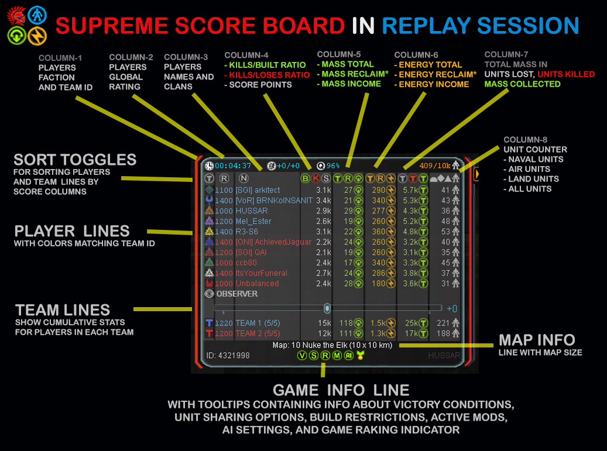
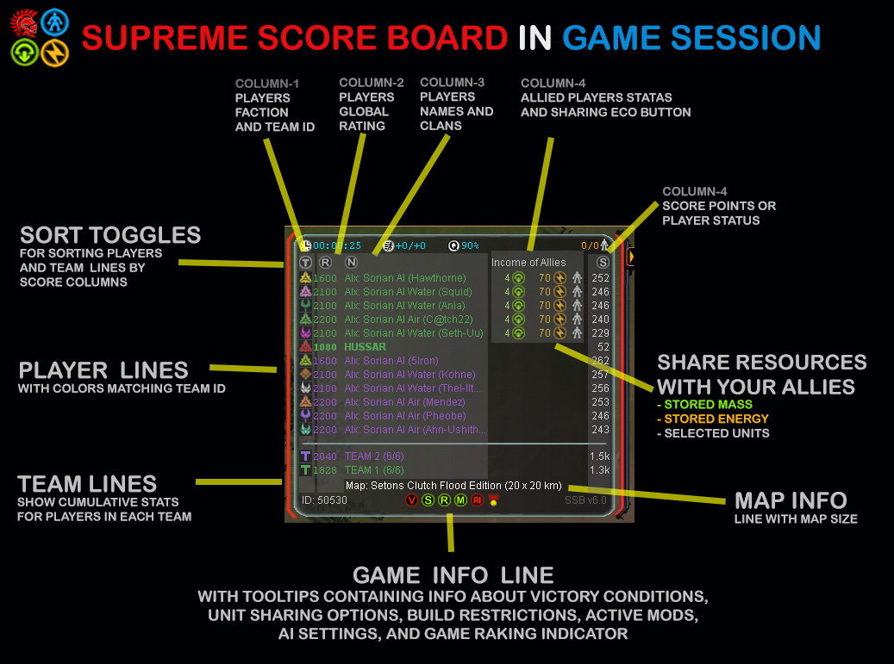

# SupremeScoreBoard (UI) mod

This repository contains implementation of a mod for Supreme Commander FA game. This mod changes only User Interface of the game and it can be used in multiplayer games withouth affecting other players. This mod is fully compatiable with Forged Alliance Forever.

## Preview

<html lang="en" xmlns="http://www.w3.org/1999/xhtml">
    <body style="background: red">
        
        
    </body>
</html>

## Features
Refer to this <a href="http://forums.faforever.com/viewtopic.php?f=41&t=10887" target="_blank">post</a> on FAF forum.  

## Installation

Download the **Supreme Score Board** mod from the vault in <a href="https://www.faforever.com/client" target="_blank">Forged Alliance Forever</a> client

or

1. Open <a href="https://github.com/FA-mods/SupremeScoreBoard/tree/master/versions" target="_blank">versions</a> folder and download a zip file with latest version of SupremeScoreBoard mod.
2. Open your "Mods" folder for Supreme Commander FA game, e.g.

C:\Users\USER_NAME\Documents\My Games\Gas Powered Games\Supreme Commander Forged Alliance\Mods\

3. Delete the SupremeScoreBoard folder (if it exists). This will prevent conflicts between older version of this mod.
4. Unzip the downloaded zip file to your "Mods" folder 
5. Make sure mod_info.lua file is in this folder and not in subfolders of:

C:\Users\USER_NAME\Documents\My Games\Gas Powered Games\Supreme Commander Forged Alliance\Mods\SupremeScoreBoard\

6. Enable SupremeScoreBoard mod in Mod Manager (in Supreme Commander FA game)

## License

The is a very permissive license for software and other scientific or artistic works that offers a great degree of freedom. In fact, it is probably the best license out there. 
It is free to do what ever your like :D

## Contribution

All contributions are welcome, though I can't guarantee to pull all of them in. If you want to contribute, please create a separate branch and a pull request with your changes. 
Thanks in advance.

## Contact Info
Shoot me a message on <a href="http://forums.faforever.com/memberlist.php?mode=viewprofile&u=9827" target="_blank">FAF forum </a> or <a href="https://www.faforever.com/client" target="_blank"> FAF client's</a> chat. Also, you can find me on <a href="faforever.slack.com" target="_blank">FA Forever Slack channel</a> or <a href="https://discord.gg/hgvj6Af" target="_blank">FAF Discord</a>. My user name is "HUSSAR"

## History

### Version 4-6 - November 12, 2020
- added economy income of allied players in game session
- added economy storage of allied players in game session
- added support for sharing economy when phantom mod is enabled
- added player's name when someone creates a ping on the map
- fixed original score board floating on game start
- fixed hiding of SSB on toggle all UIs off
- fixed initialization of players colors in SSB

### Version 3 - November 3, 2020
- fixed displaying of reclaimed stats in score board
- fixed speed slider when changing game speed via keyboard shortcut
- fixed flashing of faction icon when a user creates a ping on the map

### Version 1.4 - October, 2017
- fixed an issue with selecting text color for armies due to changes in FAF army colors
- fixed an issue finding map quadrant for an army with incorrect army key defined in [map name]_save.lua

### Version v1.3 - July, 2016
- added info about who killed a player in Army notification window
- added info about who decided to CTRL+K in Army notification window
- added coloring of player names in Army notification window
- added mod configuration under Game -> Options -> Interface tab
- added interaction states for buttons in the sort line (first line of the score board)
- fixed mouse interaction in top row, now left click will show values in columns
- fixed mouse interaction in top row, now right click will sort values in columns
- fixed compatibility with other mods that modify score.lua (e.g. EcoManager) and SSB takes precedence over these mods
- fixed numbering of teams based on players' starting locations and map quadrants (per Gyle request)
- fixed messages with sent resources/units to allies (observer will see message target)
- fixed tooltip that shows unit restrictions and separated presets from custom restrictions
- fixed detection for unranked games (if restrictions count greater than zero)
- increased number of notifications for built experimental units (2 -> 5)
- increased precision for rounding large numbers (1.2m -> 1.23m)
- improved description of tooltips

### Version v1.2 - January, 2016
- (all sessions) added replay ID below map info line
- (all sessions) added calculation of game quality/balance if this value is not present in session options
- (game session) added buttons for sharing mass/energy/units with allied human players (faster than LazyShare) 
- (game session) added buttons for sharing mass/energy/units with allied AI players 
- (game session) added chat notifications for transferred amount of mass/energy to allied players
- (game session) added chat notifications for transferred number of units to allied players
- (game session) added separator lines between players' lines and teams' lines in game session 
- (replay session) changed reclaim column to show reclaim values (works with latest FAF beta patch)
- (replay session) added auto-hiding multifunction panel because it is not used in replays at all
- (replay session) added auto-switching between score columns (e.g. units types air|land|naval)
- (replay session) clicking on a column toggle will disable auto-switching columns 
- fixed coloring of player names when they are not in teams (e.g. Phantom games)
- fixed coloring of player names in replay session
- fixed information in tooltips 
- fixed conditions for checking ranked games
- fixed teams statistics by including score data for dead players  
- fixed team status that shows how many players are still alive
- fixed detection of dead players in sandbox games
- fixed placement of icons in the sort line
- fixed alignment of top line with its background
- fixed very long map names by truncating them to 30 chars
- changed background of the score board to darker color (better visibility of player names)
- changed units column to show air/land/navy/all instead of cumulative values, e.g. air + navy
- changed ranking column to show exact values in ladder games and rounded values in regular games
- changed coloring of player names and now they will match color of team
- changed column with player names to include clan tags (if they exist)

### Version 1.1 - October 5, 2015
- fixed info about active mods in replay session
- fixed status of game raking
- fixed tooltip about game quality/balance
- added coloring of player names based on team color 

### Version 1.0 - September 25, 2015
- added team lines that sums up statistics for allied players
- added column with filters to show count of air/land/navy/base units  
- added column for total mass of collected/killed/lost
- added column for players rating to prevent clipping by score values
- added toggle to show and sort players by their army rating
- added toggle to show and sort players by total mass collected
- added toggle to show and sort players by total mass reclaimed*
- added toggle to show and sort players by total energy reclaimed*
- added toggle to show and sort players by total energy collected
- added toggle to show and sort players by their clan tags
- added toggle to show and sort players by Kills-to-Loses Ratio
- added toggle to show and sort players by Kills-to-Built Ratio
- added toggle to sort players by current mass income
- added toggle to sort players by current energy income
- added toggle to sort players by current score value
- added toggle to sort players by their army name
- added toggle to sort players by their clan tag
- added toggle to sort players by their team id
- added sorting by two columns when value in the first sorting are equal, e.g. sorting by team ID and then by mass income
- added team status showing alive/maximum players 
- added rendering players names with red/green when in players view to show allies/enemies 
- added calculation of AI rating based on AI type and AI cheat modifiers
- added field showing game quality based on network connection between players
- added tooltips for all new UI elements in the score panel
- added info about map size
- added icons with improved quality for mass, energy, units
- added icons with info about game restrictions
- added icons with info about active mods
- added icons with info about unit sharing
- added icons with info about victory conditions
- added icons with info about AI multipliers
- added notifications about 1st experimental unit built by a player
- fixed game time/speed fields into two fields   
- fixed unit counter to show unit count of all armies (in observer view) or just player's units (in player view) 
- fixed missing tooltip for game speed slider
- fixed performance in updating score panel by limiting number of for loops (n*n-times to n-times)
- fixed issues with performing operations on uninitialized values of score data
- fixed redundant function calls to GetArmiesTable().armiesTable
- fixed redundant function calls to GetFocusArmy()
- fixed redundant function calls to SessionIsReplay()
- fixed redundant function calls to SessionGetScenarioInfo()
- fixed redundant imports of some LUA scripts (e.g. announcement.lua)
